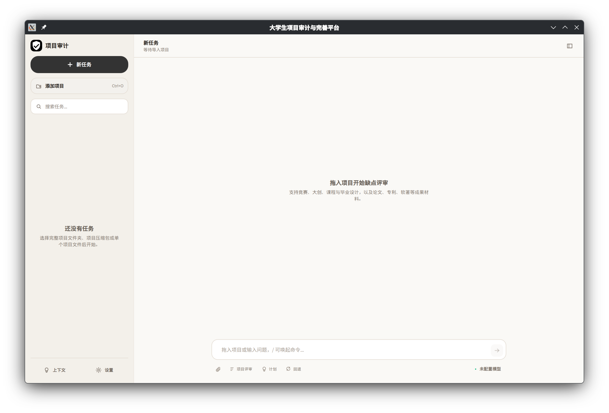
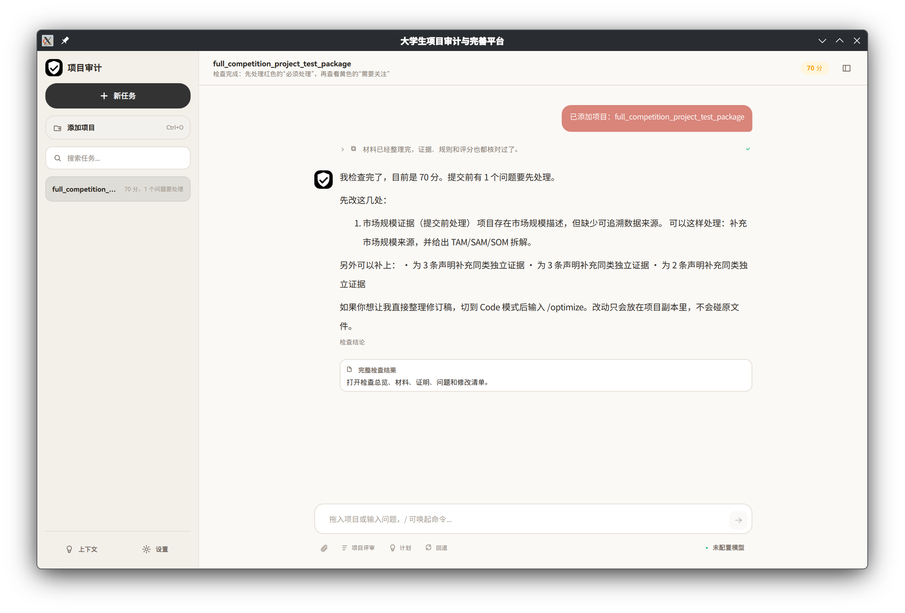

# 大学生项目材料审计平台

一套已经完整实现、可直接构建运行的大学生竞赛项目材料审计与完善工作台。平台把项目目录、单份材料或压缩包转换为资产清单、项目画像、声明—证据关系、一致性问题、赛道规则风险、可信评分、补证任务和可导出的审计报告。

当前版本：`0.1.0`（完成版）<br>
技术栈：C++20、CMake、Qt 6/QML、JSON Rule Packs<br>
运行入口：`contest-workbench`



## 已完成功能

- 导入项目目录、任意单文件，以及 ZIP、TAR、TGZ、GZ、BZ2、XZ、ZST、7Z 等材料包。
- 在隔离工作区中整理材料，不覆盖原项目，不默认执行项目脚本。
- 识别文档、源码、配置、图片、音视频、模型、归档和未知二进制资产。
- 从纯文本、OpenXML 和 PDF 内容流中提取可审计文本。
- 自动判断商业创新、软件、科研、社会实践和电商等竞赛类型。
- 生成 CPIR 项目画像，抽取成果声明并匹配证据文件。
- 检查跨文件名称、数据、时间、源码、构建入口和商业材料的一致性。
- 执行多赛道 JSON 规则，输出 blocker、warning、info 和可信债务。
- 生成可信评分、P0/P1/P2 补证任务、安全修订计划和二次审计差分。
- 通过会话工作区展示阶段进度、工具观察、项目上下文、历史任务和报告 artifact。
- 支持 ask、plan、code、bypass 四种访问模式；写入仅发生在安全副本。
- 导出 Markdown/JSON 报告。
- 可选接入 Anthropic、OpenAI-compatible、DeepSeek 或自定义兼容端点；最终评分始终由确定性规则产生。
- 支持浅色/深色外观、主题色、背景皮肤、字体和字号设置。



## 快速开始

项目只使用系统工具链和系统开发包。CMake 预设会清空 Conda、`CMAKE_PREFIX_PATH` 和 `PKG_CONFIG_PATH` 对依赖解析的影响；任何解析到 Conda/Anaconda 目录的编译器或依赖都会使配置直接失败。

系统依赖包括：

- CMake 3.24+
- Ninja
- 支持 C++20 的 GCC 或 Clang
- Qt 6 Core、Gui、Qml、Quick、QuickControls2、QuickDialogs2
- OpenSSL、Zlib、libarchive、pugixml、nlohmann-json、Catch2
- clang-format、clang-tidy（完整质量检查需要）

Fedora 可使用系统包安装：

```bash
sudo dnf install cmake ninja-build gcc-c++ clang clang-tools-extra \
  qt6-qtbase-devel qt6-qtdeclarative-devel openssl-devel zlib-devel \
  libarchive-devel pugixml-devel json-devel catch-devel
```

构建、测试并启动：

```bash
cmake --preset debug
cmake --build --preset debug
ctest --preset debug --output-on-failure
./build/debug/contest-workbench
```

也可以在启动时直接导入并审计项目：

```bash
./build/debug/contest-workbench --project /path/to/project
```

仓库内置完整演示材料：

```bash
./build/debug/contest-workbench \
  --project examples/full_competition_project_test_package
```

## 使用流程

1. 点击“添加项目”、拖入材料，或在 composer 中粘贴本地路径。
2. 平台建立隔离副本并自动执行分阶段审计。
3. 在会话结论中先处理红色的“必须处理”，再处理黄色的“需要关注”。
4. 打开“完整检查结果”查看资产、画像、证据、一致性、问题和修改任务。
5. 如需生成修订稿，切换到 Code 模式后执行 `/optimize`；原项目不会被修改。
6. 重新审计修订副本，查看修改前后差分并导出报告。

常用命令：

| 命令 | 作用 |
|---|---|
| `/audit` | 重新运行确定性审计 |
| `/agent <任务>` | 提交智能体任务 |
| `/optimize [目标]` | 在安全副本中生成修订稿并复审 |
| `/status` | 查看当前会话状态 |
| `/compact` | 压缩会话上下文 |
| `/clear` | 新建会话 |
| `/help` | 显示命令帮助 |

## 架构

```text
contest-workbench  Qt/QML 界面、会话交互、结果展示与导出入口
        │
contest_llm        可选 LLM 请求、模型目录、Brain 循环与建议校验
        │
contest_agent      工具注册、权限门控、Hooks、会话与分阶段编排
        │
contest_core       导入、识别、抽取、画像、证据、规则、评分、修复与报告
        │
JSON rule packs    多赛道可配置审计规则
```

核心业务逻辑不放在 QML 或 Controller 中。`contest_core` 不链接 LLM/OpenSSL；网络能力独立位于 `contest_llm`。LLM 建议必须经过规则和证据校验，不能覆盖确定性评分。

## LLM 配置（可选）

没有 API Key 时，全部本地审计能力仍可使用，并且不会联网。

```bash
export OPENAI_API_KEY="..."
export OPENAI_BASE_URL="https://api.openai.com"
export OPENAI_MODEL="<可用模型 ID>"

# 或统一兼容配置
export LLM_API_KEY="..."
export LLM_BASE_URL="https://example.com/v1"
export LLM_MODEL="<可用模型 ID>"
```

同时配置多家服务时，通过 `LLM_PROVIDER=anthropic|openai|deepseek` 指定服务。密钥只保存在运行时内存中，不写入源码、报告或交付包。

## 质量保证

```bash
./tools/acceptance.sh
./tools/quality.sh
```

检查范围包括：

- GCC Debug 严格警告构建（`-Wall -Wextra -Wpedantic -Wconversion -Wsign-conversion -Wshadow -Werror`）；
- Clang ASan/UBSan 严格警告构建；
- 单元测试与固定依赖 smoke test；
- clang-format 和 clang-tidy；
- 全量 QML 静态检查与无界面启动检查；
- 系统依赖路径检查，禁止构建缓存和编译命令引用 Conda；
- 模块边界、归档安全、Workbench 结构和交付内容验收。

## 安全边界

- 所有输入先进入 `.workspaces/<session_id>/input/` 隔离副本。
- 拒绝路径穿越、重复目标、文件/目录冲突、压缩炸弹和损坏归档。
- 超大、过深、加密、嵌套或预算外文件保留元数据并明确降级，不伪装成已审计。
- 不调用 shell `unzip`、`pdftotext` 或项目内脚本处理不可信输入。
- 不生成虚假用户、营收、合作、专利、实验结果或市场数据。
- Code 模式也只修改安全工作副本。

## 文档与目录

```text
apps/contest-workbench/   Qt/QML 桌面端
include/cc/               公共 C++ 接口
src/                      Core、Agent、LLM 实现
rules/                    多赛道 JSON 规则包
tests/                    单元测试与依赖测试
examples/                 完整演示包和各赛道问题案例
tools/                    验收、质量检查和打包脚本
docs/                     需求、架构、规范、安全与验收文档
```

保留的详细文档：

- `docs/02_functional_requirements.md`：功能规格
- `docs/03_architecture_and_directory_tree.md`：架构与目录边界
- `docs/06_cpp_engineering_and_comment_style.md`：C++ 工程规范
- `docs/07_rule_pack_spec.md`：规则包规范
- `docs/08_security_model.md`：安全与权限模型
- `docs/09_test_and_acceptance.md`：测试和验收方案
- `docs/REQUIREMENT_AUDIT.md`：需求落实矩阵

## 打包

```bash
./tools/package_release.sh
```

命令会在项目根目录生成可交付的 TGZ 包，包含 Workbench、规则包、示例、工具、文档和 README。
